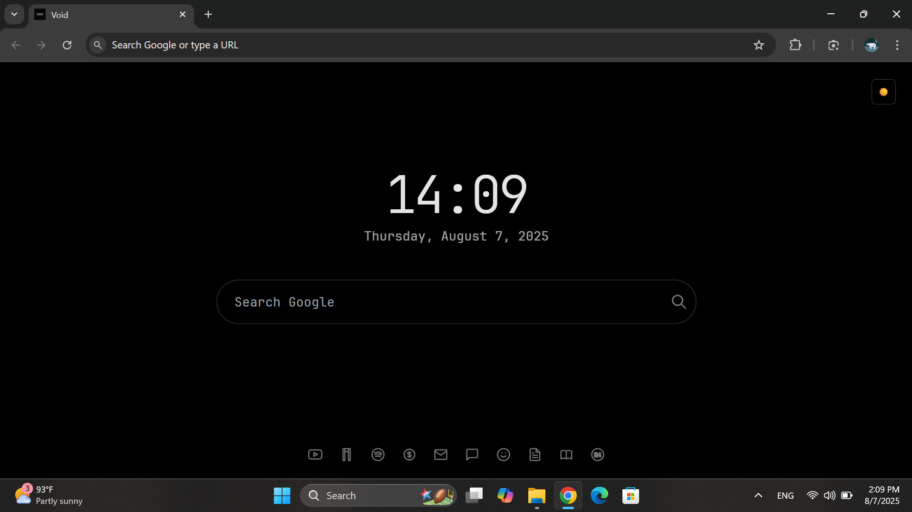
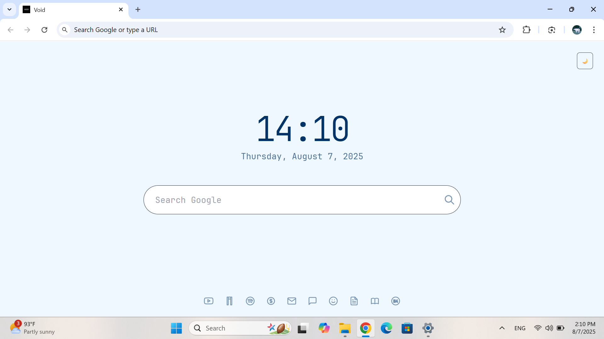

# 🌌 Void_nyx

A fully offline, custom-built new tab page for Chrome — handcrafted in **pure Notepad** because boredom hits different when you're built different.

Goodbye bland. Hello Void.

---

## ✨ Features

- 🕒 **Minimal Clock & Date** – clean AF
- 🔍 **Google Search Bar** – right where you need it
- 🌐 **Quick Access Links** – with hover labels so you're never lost
- 🌓 **Dark & Light Theme Toggle** – because moods change
- ⚡ **Offline Ready** – zero network, zero problem
- 💾 **Built using only HTML, CSS (Tailwind via JS), and pure JS**

---

## 📸 Screenshots

| Dark Mode | Light Mode |
|----------|-------------|
|  |  |

---

## 🧠 Why?

> Got bored of Chrome’s OG new tab. So I made my own — from scratch. No frameworks. No bullshit. Just Notepad and late-night motivation.

---

## 🚀 How to Use

1. Go to `chrome://extensions`
2. Enable **Developer Mode**
3. Click **"Load unpacked"**
4. Select the folder with this project
5. Done. Your new tab is now Void.

---

## 🔧 Customization

Wanna tweak themes, links, fonts, or vibes?  
Check out the HTML and JS — everything’s clean, readable, and begging to be customized.

---

## 📜 License

MIT — [LICENSE](LICENSE)  
Use it. Modify it. Just don’t forget who cooked it first.

---

## 🤙 Final Words

Made with 🖤 by someone tired of ugly tabs.  
PRs welcome. Or just fork it and flex.

> `Void_nyx` — because your browser deserves soul.
